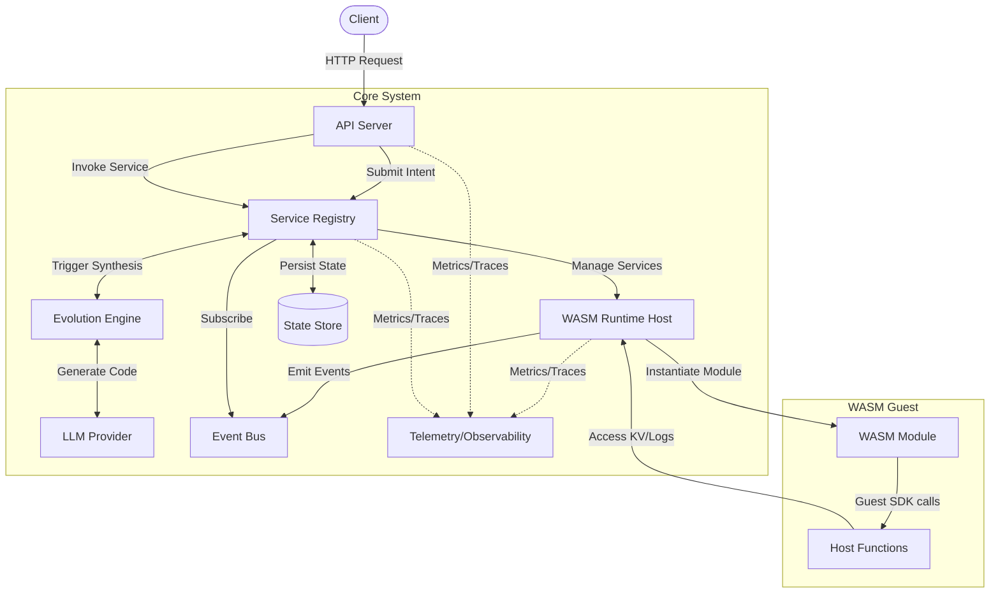
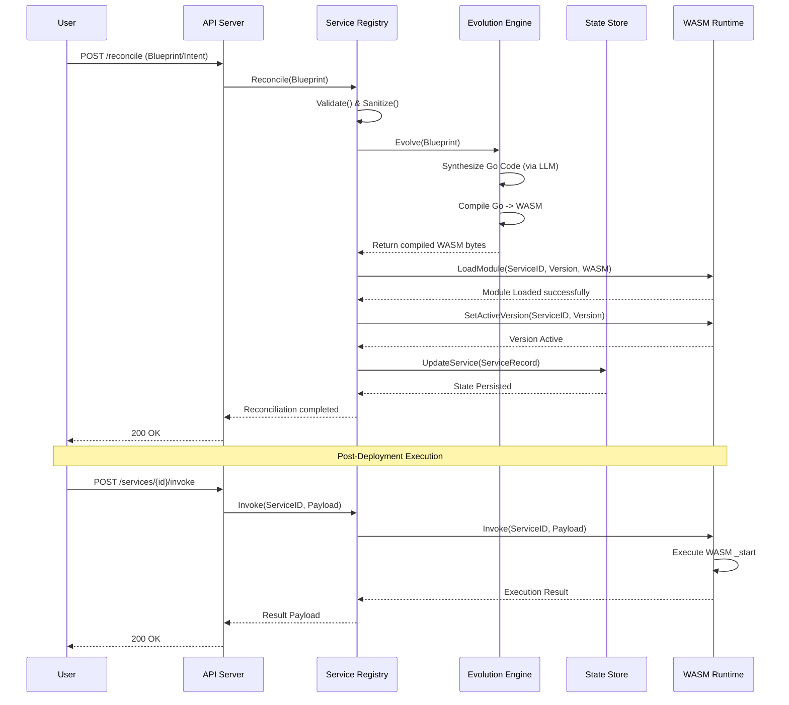

# Ghost Ops Architecture

## System Components

The Ghost Ops system is composed of several core components that work together to provide a self-healing, evolutionary WebAssembly (WASM) runtime environment.

### Core Components

*   **API Server (`pkg/api`)**: Exposes REST endpoints for submitting intents, invoking services, and retrieving logs/metrics.
*   **Service Registry (`pkg/registry`)**: The brain of the system. Manages the lifecycle of services, coordinates evolution, state persistence, and runtime deployment.
*   **Evolution Engine (`pkg/evolution`)**: Takes a blueprint (intent) and synthesizes Go code using an LLM provider, then compiles it into a WASM module.
*   **WASM Runtime Host (`pkg/runtime`)**: Powered by Wazero. Responsible for securely loading, executing, and isolating compiled WASM modules.
*   **State Store (`pkg/store`)**: Persists service records, dependencies, and cluster state (JSON file, Redis, or In-Memory).
*   **Telemetry/Observability (`pkg/telemetry`, `pkg/logging`)**: Integrates with OpenTelemetry for distributed tracing and Prometheus-style metrics, providing full visibility into the system.
*   **Event Bus (`pkg/event`)**: Facilitates internal pub/sub messaging (e.g., service deployed, service unhealthy) to decouple components.

---

## Execution Flow (The ZHO Loop)

This diagram illustrates the lifecycle of a single Work Unit (WU) from a user's initial intent to the final deployed WASM service.

## Resilience and Self-Healing

The system employs Service Mesh Lite patterns (`pkg/resilience`) including Retries, Circuit Breakers, and Rate Limiters to ensure stability during failures or high load. The Registry runs a continuous background health check that unloads unhealthy services, triggering the Zero-Human Operations (ZHO) re-evolution feedback loop.
