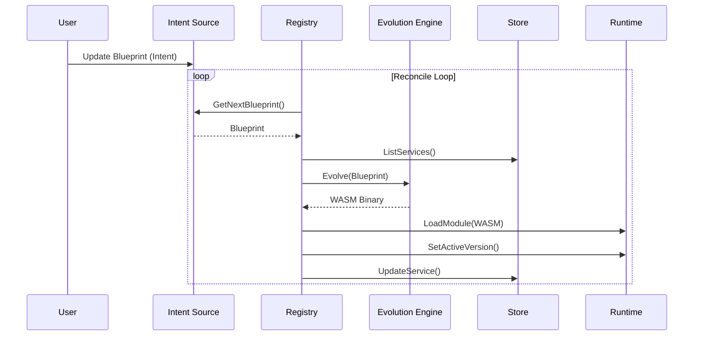

# Ghost Ops Architecture

## System Overview

```mermaid
graph TD
    CLI[Ghost Ops CLI] --> API[API Server]
    API --> REG[Service Registry]
    REG --> STORE[(State Store)]
    REG --> ENGINE[Evolution Engine]
    REG --> RUNTIME[Runtime Host (WASM)]
    RUNTIME --> WASM[WASM Guest Modules]
    WASM --> HOST[Host Functions]
    HOST --> STORE
    HOST --> RUNTIME
    OBS[Telemetry] -.-> RUNTIME
    OBS -.-> REG
    OBS -.-> API
```

## Evolution Flow


