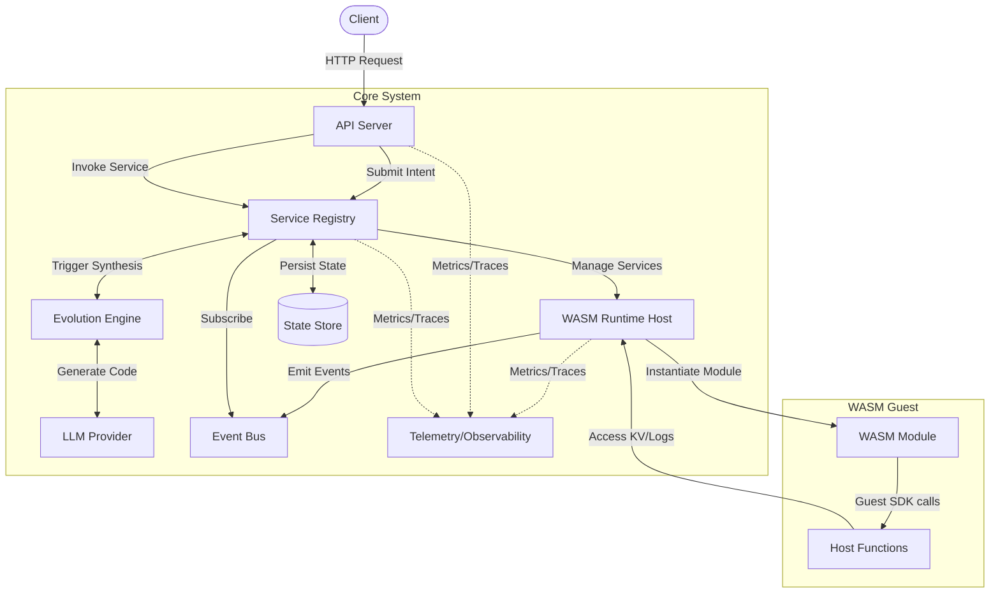
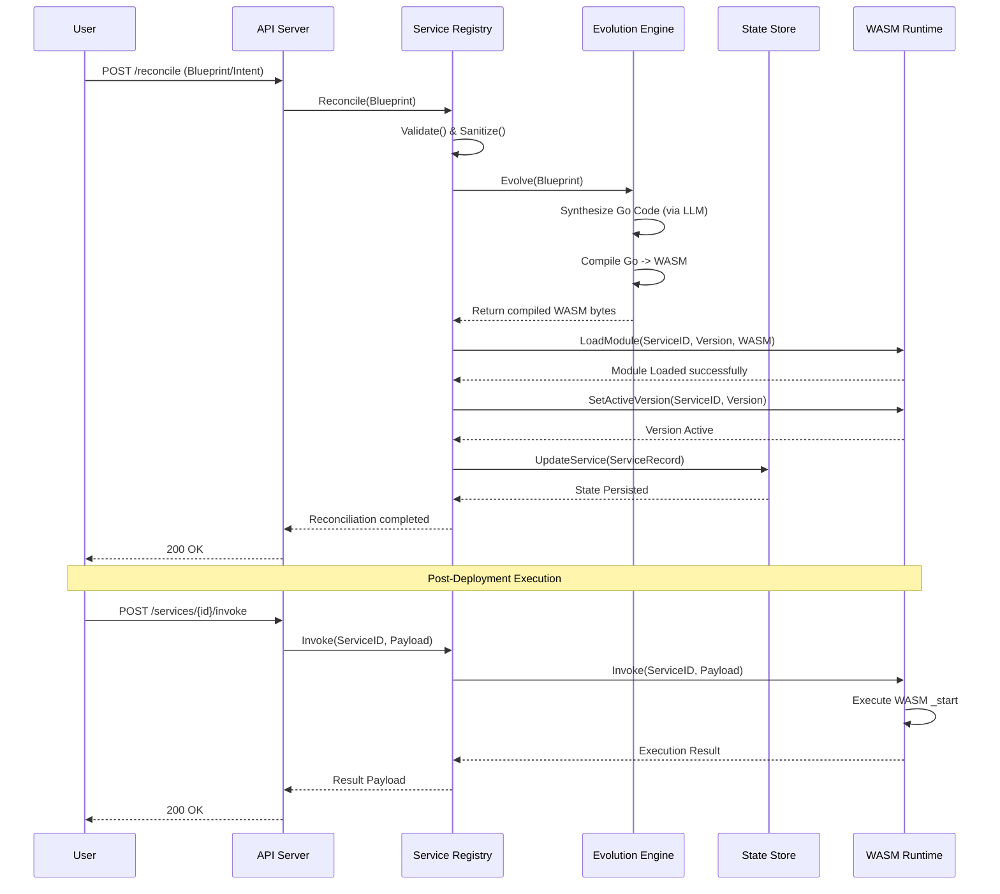
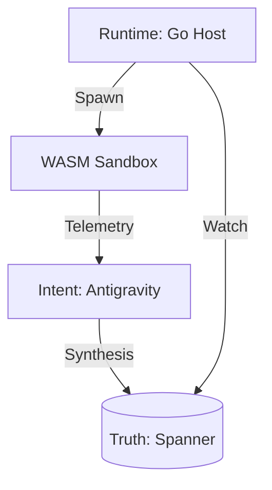

# Vision: The Ghost Ops Constitution

## 1. North Star
**Zero-Human Operations (ZHO).**
The system patches, optimizes, and evolves itself. Human intervention is a failure of the system.
Ghost Ops moves beyond maintenance. It treats source code as **ephemeral**—generated by AI intent, compiled to **WASM**, executed in a sandbox, and discarded when a better version is evolved.
*   **Zero-Human Operations (ZHO):** No JIRA tickets. The system patches and optimized itself.
*   **Just-In-Time Execution:** Services exist only when needed, reducing cold starts (<10ms) and carbon footprint.

## 2. Pipeline Laws
1.  **Latest Stable Environment Only:** Backward compatibility is not a goal; the system evolves forward.
2.  **Ephemeral Code:** Source code is a liability. It is generated, compiled, executed, and discarded.
3.  **Simple-First:** Complexity is the enemy. If a feature serves <1% of use cases, defer it.

## 3. Definition of Done (DoD)
Every Work Unit (WU) must satisfy the **Adversarial Triad** (Optimizer, Hardener, Pragmatist):
*   **Test (95%):** Unit coverage > 95%. Integration tests for critical paths.
*   **Lint (0-err):** No linting errors (staticcheck, go vet).
*   **Opt (Big O):** O(n) or better complexity verified.
*   **Sec (Sanitize):** Input validation and output sanitization.

## 4. Ideal State
The system observes runtime metrics (latency, error rates), identifies inefficiencies, generates optimized WASM code (via LLM), tests it in Shadow Mode, and hot-swaps the active version—all without human intervention.

## 5. Roadmap Phases

### [PHASE-0: Hygiene & Foundations]
*Focus: Stabilization, Developer Experience, and CI/CD.*
- **Goal:** Clean, testable, and verifiable codebase.
- **Key Deliverables:** Linting, comprehensive testing, structured logging, basic health checks.

### [PHASE-1: MVP - The Self-Healing Loop]
*Focus: Closing the loop between Intent, Code, and Runtime.*
- **Goal:** Intent -> Code -> WASM -> Runtime -> Feedback.
- **Key Deliverables:** AI Evolution Engine, Shadow Mode, persistent state, basic CLI.

### [PHASE-2: Scale - Distributed & Resilient]
*Focus: Moving from a single binary to a distributed system.*
- **Goal:** Run thousands of ephemeral services.
- **Key Deliverables:** Distributed Store (Redis/Etcd), Remote Registry, Horizontal Scaling.

### [PHASE-3: Future - Autonomous Evolution]
*Focus: The system becomes self-aware.*
- **Goal:** Autonomous optimization based on runtime feedback.
- **Key Deliverables:** Runtime Metrics -> Re-Prompting Loop, Multi-Language SDKs, Automated Security, Cluster State Management, Dynamic Routing.

## 6. Execution Workflow
1. SCAN: Full-tree analysis. Identify Implementation vs. Vision Gaps.
2. CONSTITUTE: Sync `vision.md` (Laws, Pipeline, Ideal State).
3. PLAN (RECURSIVE): Execute [Drill-Down/Up] logic. Update `.memory/` to track traversal.
4. VAULT: Move "Done" to `release-notes.md` (Reverse-Chronological). Bump version and sync code-side VERSION files.
5. RECOVERY CHECK: Verify `docs/backlog.md` for consistency.
6. EXIT: Raise PR.

## 7. Architecture

### System Components

The Ghost Ops system is composed of several core components that work together to provide a self-healing, evolutionary WebAssembly (WASM) runtime environment.



### Core Components

*   **API Server (`pkg/api`)**: Exposes REST endpoints for submitting intents, invoking services, and retrieving logs/metrics.
*   **Service Registry (`pkg/registry`)**: The brain of the system. Manages the lifecycle of services, coordinates evolution, state persistence, and runtime deployment.
*   **Evolution Engine (`pkg/evolution`)**: Takes a blueprint (intent) and synthesizes Go code using an LLM provider, then compiles it into a WASM module.
*   **WASM Runtime Host (`pkg/runtime`)**: Powered by Wazero. Responsible for securely loading, executing, and isolating compiled WASM modules.
*   **State Store (`pkg/store`)**: Persists service records, dependencies, and cluster state (JSON file, Redis, or In-Memory).
*   **Telemetry/Observability (`pkg/telemetry`, `pkg/logging`)**: Integrates with OpenTelemetry for distributed tracing and Prometheus-style metrics, providing full visibility into the system.
*   **Event Bus (`pkg/event`)**: Facilitates internal pub/sub messaging (e.g., service deployed, service unhealthy) to decouple components.

### Execution Flow (The ZHO Loop)

This diagram illustrates the lifecycle of a single Work Unit (WU) from a user's initial intent to the final deployed WASM service.



### Resilience and Self-Healing

The system employs Service Mesh Lite patterns (`pkg/resilience`) including Retries, Circuit Breakers, and Rate Limiters to ensure stability during failures or high load. The Registry runs a continuous background health check that unloads unhealthy services, triggering the Zero-Human Operations (ZHO) re-evolution feedback loop.

## 8. Master Spec

### The Abstract Protocol (Universal Standard)
Any Ghost Ops system must satisfy these interfaces:
1.  **IntentSource:** The oracle (e.g., Antigravity).
2.  **EvolutionEngine:** The brain that converts Intent -> Code.
3.  **StateStore:** The global truth registry.
4.  **RuntimeHost:** The muscle (WASM Sandbox).

### Reference Architecture (Google Cloud)
This implementation maps the abstract protocol to concrete GCP services.

#### Architecture Overview


#### Global Schema (Spanner)
```sql
CREATE TABLE Services (
  ServiceID STRING(36) NOT NULL,
  WASM_Hash STRING(64) NOT NULL,
  Current_State STRING(32) NOT NULL, -- ACTIVE, SHADOW, PURGING
  Synthesis_Timestamp TIMESTAMP
) PRIMARY KEY (ServiceID);

CREATE TABLE Synthesis_Blueprints (
  BlueprintID STRING(36) NOT NULL,
  Intent_Template STRING(MAX) NOT NULL
) PRIMARY KEY (BlueprintID), INTERLEAVE IN PARENT Services ON DELETE CASCADE;
```

#### The Synthesis Contract
**Input (Blueprint):**
```json
{ "service_id": "auth-v1", "intent": "JWT RS256 Auth", "constraints": {"p99": 50} }
```

**Output (Host ABI):**
```typescript
interface GhostOps { kv_get(k): bytes; rpc(svc, meth, pay): bytes; }
```

### Operational Layout
*   **Brain:** `~/.gemini/antigravity` (Intent & Task Context)
*   **Body:** `/generated/services` (Ephemeral WASM binaries & Go source)
*   **Docs:** `/docs/ghost_ops_master_spec.md` (This file)