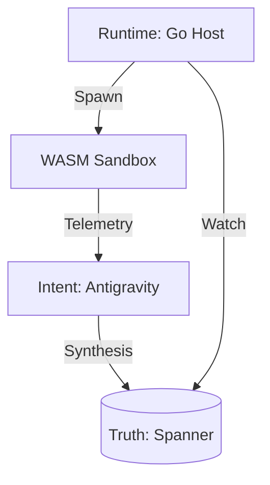

# Ghost Ops "Master Spec"
**Version:** 2.0 (Consolidated)  
**Status:** Architecture Locked

---

## 1. The Vision: "Dark Software"
Ghost Ops moves beyond maintenance. It treats source code as **ephemeral**—generated by AI intent, compiled to **WASM**, executed in a sandbox, and discarded when a better version is evolved.
*   **Zero-Human Operations (ZHO):** No JIRA tickets. The system patches and optimized itself.
*   **Just-In-Time Execution:** Services exist only when needed, reducing cold starts (<10ms) and carbon footprint.

---

## 2. The Abstract Protocol (Universal Standard)
Any Ghost Ops system must satisfy these interfaces:
1.  **IntentSource:** The oracle (e.g., Antigravity).
2.  **EvolutionEngine:** The brain that converts Intent -> Code.
3.  **StateStore:** The global truth registry.
4.  **RuntimeHost:** The muscle (WASM Sandbox).

---

## 3. Reference Architecture (Google Cloud)
This implementation maps the abstract protocol to concrete GCP services.

### 3.1 Architecture Overview


### 3.2 Global Schema (Spanner)
```sql
CREATE TABLE Services (
  ServiceID STRING(36) NOT NULL,
  WASM_Hash STRING(64) NOT NULL,
  Current_State STRING(32) NOT NULL, -- ACTIVE, SHADOW, PURGING
  Synthesis_Timestamp TIMESTAMP
) PRIMARY KEY (ServiceID);

CREATE TABLE Synthesis_Blueprints (
  BlueprintID STRING(36) NOT NULL,
  Intent_Template STRING(MAX) NOT NULL
) PRIMARY KEY (BlueprintID), INTERLEAVE IN PARENT Services ON DELETE CASCADE;
```

### 3.3 The Synthesis Contract
**Input (Blueprint):**
```json
{ "service_id": "auth-v1", "intent": "JWT RS256 Auth", "constraints": {"p99": 50} }
```

**Output (Host ABI):**
```typescript
interface GhostOps { kv_get(k): bytes; rpc(svc, meth, pay): bytes; }
```

---

## 4. Operational Layout
*   **Brain:** `~/.gemini/antigravity` (Intent & Task Context)
*   **Body:** `/generated/services` (Ephemeral WASM binaries & Go source)
*   **Docs:** `/docs/ghost_ops_master_spec.md` (This file)
